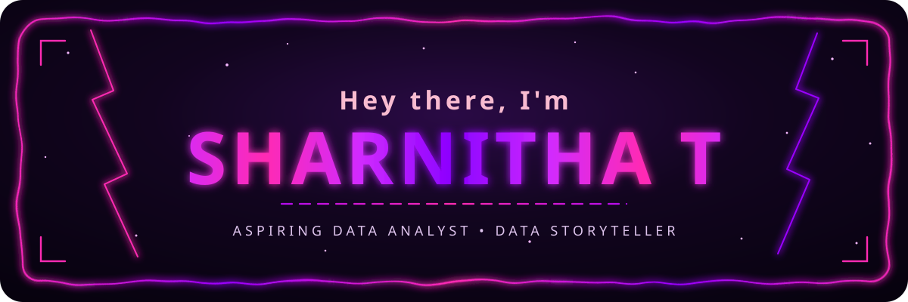
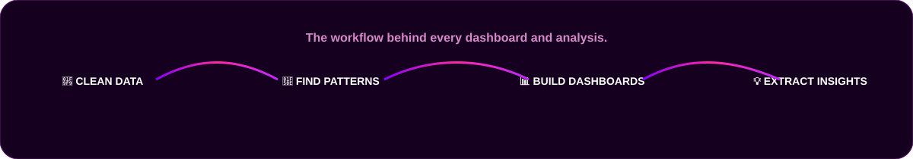
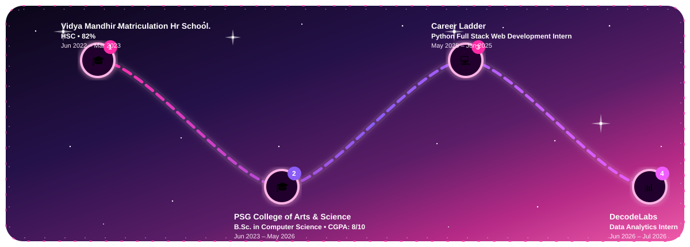
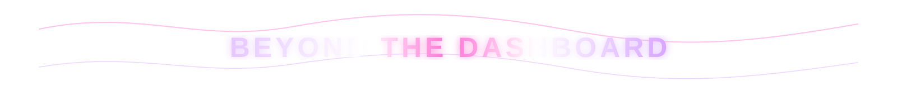
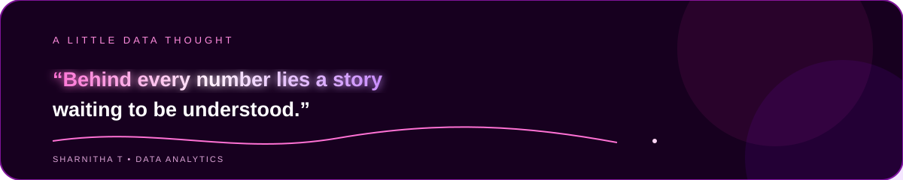

  
  
  
  

  

<b>Computer Science Graduate</b> • <b>Data Analytics Learner</b> • <b>Dashboard Builder</b>

  I'm <b>Sharnitha T</b>, a Computer Science graduate from <b>PSG College of Arts &amp; Science, Coimbatore</b>, building my career in Data Analytics. 
  I enjoy working with imperfect data, cleaning and transforming it, finding patterns, and turning those findings into dashboards and understandable stories.

<table width="100%" align="center">
<tr>
<td align="center" width="25%"><b>🔍 ANALYTICAL FOCUS</b> Data Cleaning &amp; Analysis</td>
<td align="center" width="25%"><b>🛠️ WORKFLOW</b> Clean → Transform → Analyze → Visualize</td>
<td align="center" width="25%"><b>📊 CORE TOOLS</b> Excel • Power BI • SQL • Python</td>
<td align="center" width="25%"><b>🎯 CURRENT GOAL</b> Entry-Level Data Analyst</td>
</tr>
</table>

---

<table width="100%">
<tr>
<td width="50%" align="center">

### ✈️ Flight Booking & Travel Data Analysis

<b>Customer behavior • Booking patterns • Ticket prices • Travel preferences</b>

A practical analytics project focused on exploring customer booking behavior, travel preferences, booking patterns and ticket pricing.

</td>
<td width="50%" align="center">

### 🚲 Smart City Bike Sharing Analytics

<b>Power BI • DAX • Star Schema • KPIs • Interactive Reporting</b>

Analyzing bike-sharing station activity, usage patterns, demand trends and key performance indicators through data modeling and interactive Power BI dashboards.

</td>
</tr>
<tr>
<td width="50%" align="center">

### 🩸 Fingerprint-Based Blood Group Detection

<b>Fingerprint Analysis • Image Processing • Classification</b>

A project exploring fingerprint-based analysis for blood group detection using image-based pattern recognition.

</td>
<td width="50%" align="center">

### 🚨 Crime Pattern Detection & Analysis

<b>Crime Data • Pattern Analysis • Data Visualization • Insights</b>

An analytical project focused on examining crime patterns, identifying trends, and extracting meaningful insights from crime-related data.

</td>
</tr>
</table>

  

<b>Technologies I work with to build, analyze, and turn data into insights.</b>

<table width="100%" align="center" border="1" bordercolor="#6E1A78" cellpadding="0" cellspacing="0">
<tr>
<td width="3%" align="center" valign="middle">

</td>
<td width="94%" align="center">

</td>
<td width="3%" align="center" valign="middle">

</td>
</tr>
</table>

---

<h2 align="center">💼 EDUCATION &amp; EXPERIENCE</h2>

---

<h2 align="center">🚀 CONTRIBUTION JOURNEY</h2>

<i>Every contribution becomes another mission in the journey.</i>

---

  
  
  

